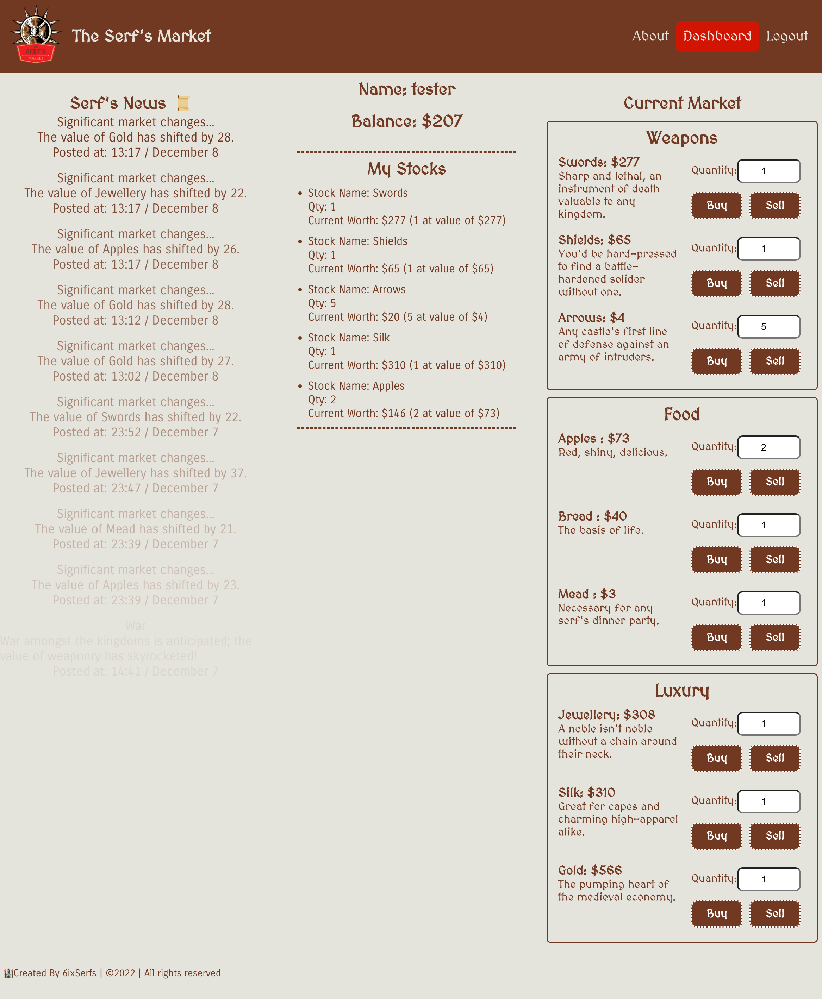

# The Serf's Market

## Table of Contents

## Description
The Serf’s Market is a full-stack game application that helps you increase your financial literacy in a fun and unique way. The game is a fictionalized & centralized online “stock” market that changes every hour, where users can create their own Peasantly Portfolio and compete against others to be the most bountiful member of the kingdom’s sub-working class. Buy stock in arrows, watch their value crash (or skyrocket in the Indo-Briton clash of 1503), and come back later to cash out big!

<a href="https://serfs-market.herokuapp.com/">Link to Deployed Application on Heroku</a>

## Technologies
* HTML5 
* CSS3
* JavaScript
* MERN (MongoDB with Mongoose, Express, REACT, NodeJS)
* GraphQL, Apollo Studio Explorer
* JSON Web Tokens
* Heroku

## Installation
npm i at the root level of the application

## Usage
Local: npm run develop 
Deployed Application: https://serfs-market.herokuapp.com/

## Credits
<a href="https://github.com/gabrielalinhares" target="_blank">@gabrielalinhares</a> 
<a href="https://github.com/helpvisa" target="_blank">@helpvisa</a> 
<a href="https://github.com/sanam1060" target="_blank">@sanam1060</a> 
<a href="https://github.com/ShawnMaz" target="_blank">@ShawnMaz</a> 
<a href="https://github.com/tonymengt" target="_blank">@tonymengt</a> 
<a href="https://github.com/raposamillar" target="_blank">@raposamillar</a> 

## License

## Screenshot
